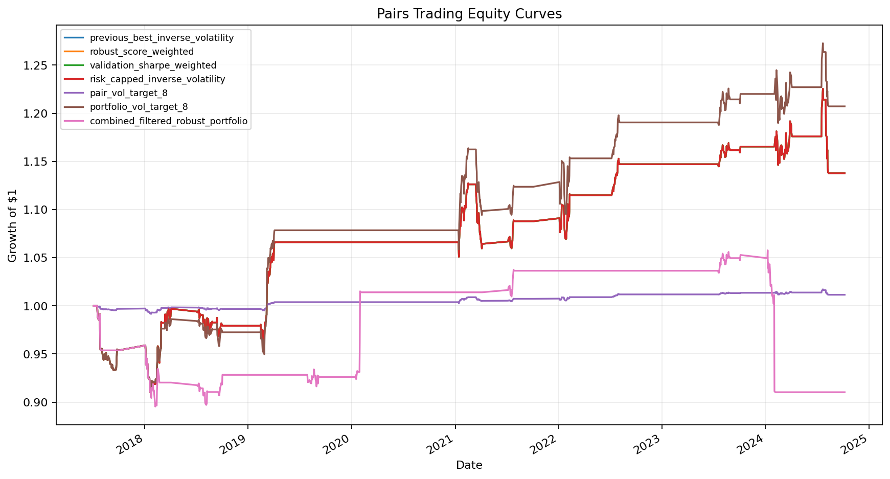
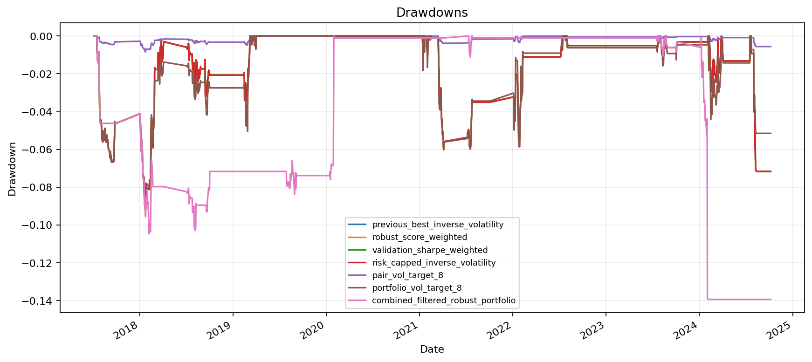
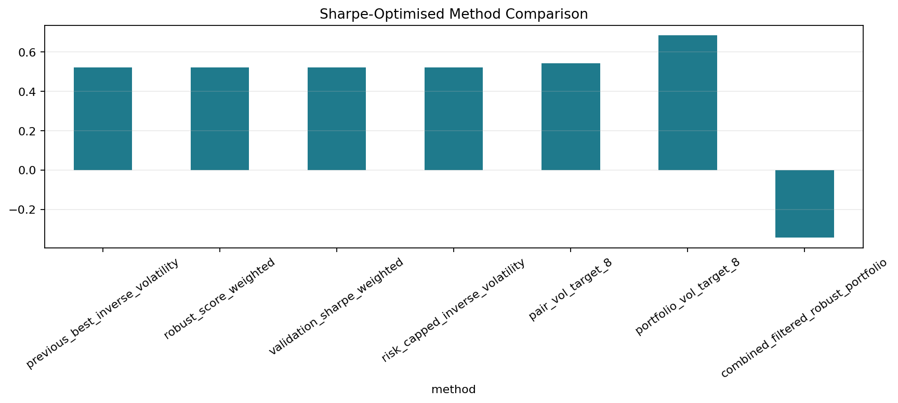
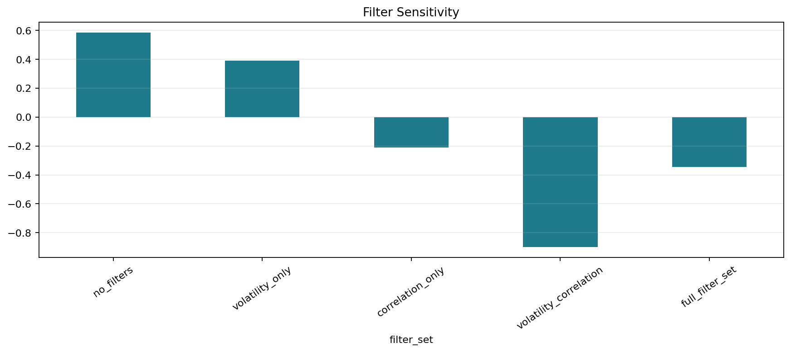
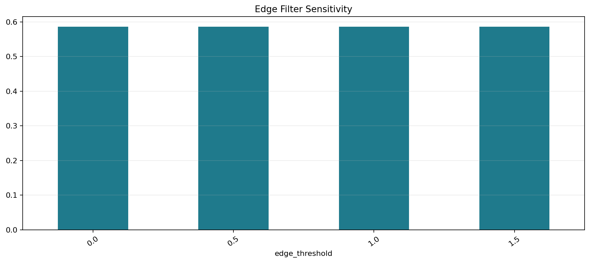
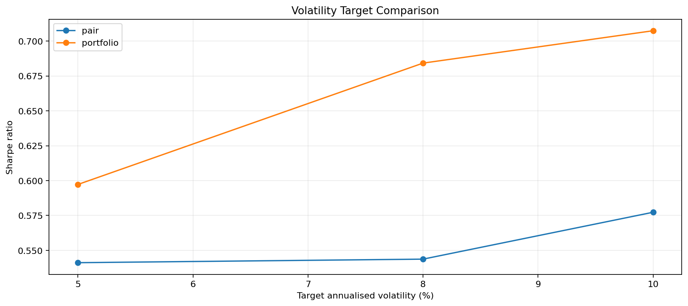

# Trading Research Dashboard: Pairs Trading & Walk-Forward Backtesting

An interactive quant research dashboard for statistical arbitrage research. The project tests stock peer-group pairs and economically related ETF pairs with cointegration diagnostics, OU-style spread statistics, static/rolling/Kalman hedge ratios, trade-level analytics, nested walk-forward pair selection, portfolio weighting, transaction-cost sensitivity, and benchmark-relative metrics.

The project remains a research validation dashboard, not a production trading claim. Results below are generated by `python main.py`.

## Key Results

- Previous best robust result was approximately `6.72%` total return, `0.38` Sharpe, and `-6.67%` max drawdown.
- The Sharpe-focused robust portfolio improved the unscaled selected portfolio to `13.77%` total return, `0.52` Sharpe, and `-9.47%` max drawdown.
- Best Sharpe-optimised method: `portfolio_vol_target_8`, with `20.72%` total return, `0.68` Sharpe, and `-9.06%` max drawdown.
- Sharpe improved, but the trade-off is important: portfolio breadth is limited. Each segment selected only one qualifying pair, so weighting methods collapse to the same exposure before volatility targeting.
- The strategy remained positive at `1`, `2`, `5`, and `10` bps in the cost-sensitivity run, but cost behaviour is not perfectly monotonic because costs can change drawdown-stop timing and realised exposure.
- The full regime filter set hurt performance in this run. The volatility-only filter was acceptable, while correlation and trend filters were too restrictive.

## Sharpe Improvement Experiment

The upgrade adds a validation-only robust score:

```text
robust_score =
    validation_sharpe
    + 0.25 * validation_profit_factor
    - 0.50 * abs(validation_max_drawdown)
    - 0.10 * turnover_penalty
    - 0.10 * instability_penalty
```

Pair and threshold selection use training and validation data only. Test windows are used only for final performance measurement.

### Sharpe-Optimised Results

| Method | Total return | CAGR | Vol | Sharpe | Sortino | Max DD | Calmar | Profit factor | Trades | Avg hold |
| --- | ---: | ---: | ---: | ---: | ---: | ---: | ---: | ---: | ---: | ---: |
| previous_best_inverse_volatility | 13.77% | 3.50% | 6.73% | 0.52 | 0.47 | -9.47% | 0.37 | 1.18 | 29 | 12.9 |
| robust_score_weighted | 13.77% | 3.50% | 6.73% | 0.52 | 0.47 | -9.47% | 0.37 | 1.18 | 29 | 12.9 |
| validation_sharpe_weighted | 13.77% | 3.50% | 6.73% | 0.52 | 0.47 | -9.47% | 0.37 | 1.18 | 29 | 12.9 |
| risk_capped_inverse_volatility | 13.77% | 3.50% | 6.73% | 0.52 | 0.47 | -9.47% | 0.37 | 1.18 | 29 | 12.9 |
| pair_vol_target_8 | 1.15% | 0.31% | 0.56% | 0.54 | 0.49 | -0.84% | 0.37 | 1.18 | 29 | 12.9 |
| portfolio_vol_target_8 | 20.72% | 5.15% | 7.53% | 0.68 | 0.66 | -9.06% | 0.57 | 1.24 | 29 | 12.9 |
| combined_filtered_robust_portfolio | -8.97% | -2.47% | 7.19% | -0.34 | -0.15 | -13.93% | -0.18 | 0.83 | 29 | 12.9 |

### Cost Sensitivity

| Cost bps | Representative strategy | Total return | Sharpe | Profit factor | Trades |
| ---: | --- | ---: | ---: | ---: | ---: |
| 0 | robust_score_weighted | 8.50% | 0.41 | 1.19 | 19 |
| 1 | robust_score_weighted | 7.78% | 0.38 | 1.18 | 19 |
| 2 | robust_score_weighted | 12.63% | 0.68 | 1.33 | 16 |
| 5 | robust_score_weighted | 10.82% | 0.59 | 1.28 | 16 |
| 10 | robust_score_weighted | 9.19% | 0.54 | 1.32 | 10 |

The cost table should be read cautiously: the drawdown stop and validation-selected parameters can change exposure when costs change, so higher-cost runs can sometimes trade less and avoid later losses.

### Filter Sensitivity

| Filter set | Total return | Sharpe | Max DD | Profit factor |
| --- | ---: | ---: | ---: | ---: |
| no_filters | 11.48% | 0.58 | -8.00% | 1.27 |
| volatility_only | 7.13% | 0.39 | -9.47% | 1.18 |
| correlation_only | -3.03% | -0.21 | -12.75% | 0.92 |
| volatility_correlation | -20.02% | -0.90 | -20.02% | 0.60 |
| full_filter_set | -8.97% | -0.34 | -13.93% | 0.83 |

### Volatility Targeting

| Method | Target vol | Total return | Sharpe | Max DD |
| --- | ---: | ---: | ---: | ---: |
| pair_vol_target_5 | 5% | 0.93% | 0.54 | -0.73% |
| pair_vol_target_8 | 8% | 1.15% | 0.54 | -0.84% |
| pair_vol_target_10 | 10% | 1.32% | 0.58 | -0.84% |
| portfolio_vol_target_5 | 5% | 13.03% | 0.60 | -7.41% |
| portfolio_vol_target_8 | 8% | 20.72% | 0.68 | -9.06% |
| portfolio_vol_target_10 | 10% | 24.18% | 0.71 | -10.15% |

Portfolio-level volatility targeting helped more than pair-level volatility targeting in this run. The 10% target has the highest Sharpe, but it breaches the prior drawdown level more than the 8% version.

## Methodology

The batch workflow runs both `stock_peer_groups` and `etf_peer_groups`.

Strict pair diagnostics require:

- training correlation >= `0.85`
- Engle-Granger p-value <= `0.05`
- residual ADF p-value <= `0.05`
- spread half-life between `3` and `45` trading days
- at least `8` z-score threshold crossings
- at least `5` completed training trades
- training Sharpe > `0.25`
- training max drawdown better than `-20%`

Nested selection uses:

- training window: `504` trading days
- validation window: `126` trading days
- test window: `63` trading days
- pair-specific threshold optimisation on validation data
- final evaluation on the next test window only
- lagged hedge ratios, lagged signals, and lagged volatility scaling

## Generated Outputs

CSV outputs include:

- `outputs/pair_screening_results.csv`
- `outputs/pair_stability_diagnostics.csv`
- `outputs/hedge_mode_comparison.csv`
- `outputs/robust_selection_scores.csv`
- `outputs/threshold_optimisation_results.csv`
- `outputs/nested_pair_selection.csv`
- `outputs/nested_walk_forward_results.csv`
- `outputs/nested_walk_forward_daily_returns.csv`
- `outputs/pair_portfolio_comparison.csv`
- `outputs/edge_filter_sensitivity.csv`
- `outputs/filter_sensitivity.csv`
- `outputs/pair_vol_target_results.csv`
- `outputs/portfolio_vol_target_results.csv`
- `outputs/sharpe_cost_sensitivity.csv`
- `outputs/sharpe_optimised_results.csv`
- `outputs/benchmark_relative_metrics.csv`
- `outputs/trade_log.csv`
- `outputs/trade_analytics.csv`
- `outputs/daily_returns.csv`

PNG outputs include:














## Run

Install dependencies:

```bash
pip install -r requirements.txt
```

Run batch analysis:

```bash
python main.py
```

Run the dashboard:

```bash
streamlit run app.py
```

## Limitations

- The best Sharpe improvement comes with limited pair breadth; this increases model fragility.
- Only 29 trades appear in the final Sharpe-optimised comparison, so statistical confidence is limited.
- ETF strict filters remain difficult to satisfy; ETF exposure appears through fallback validation candidates rather than strict stable candidates.
- The edge filter did not materially change this generated run, suggesting the edge threshold needs better calibration.
- Correlation/trend filters were too restrictive in this run.
- yfinance data can contain missing values, revisions, and vendor-specific adjustment issues.
- Borrow fees, short availability, taxes, financing costs, and intraday execution are not modelled.
- Rolling and Kalman hedge-ratio changes do not include explicit hedge-rebalancing costs.
- Positive results are modest and should be treated as research leads, not proof of a deployable strategy.
