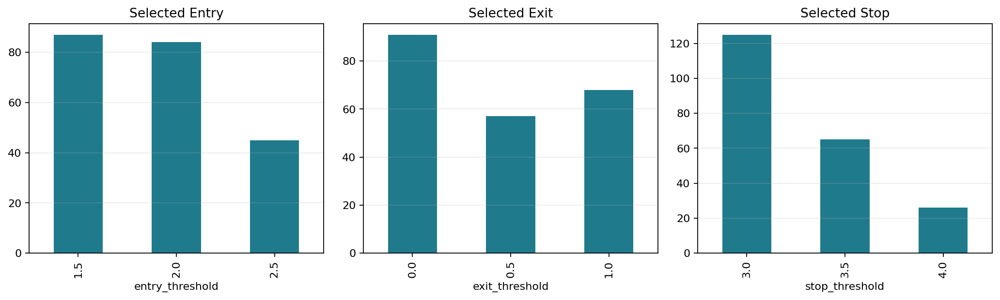

# Trading Research Dashboard: Pairs Trading & Walk-Forward Backtesting

An interactive quant research dashboard for statistical arbitrage and pairs-trading analysis. The project uses yfinance adjusted close data, peer-group pair screening, Engle-Granger cointegration, OLS hedge ratios, spread half-life diagnostics, z-score signal generation, transaction cost modelling, trade analytics, nested walk-forward validation, benchmark context, and Streamlit visualisation.

The goal is not to manufacture attractive backtests. The current methodology improves the earlier broad-universe results, but the out-of-sample edge is still weak and mixed.

## Key Findings

- Peer-group filtering improved pair quality: 6 pairs survived strict correlation, cointegration, half-life, and signal-crossing filters.
- The surviving pairs came from retail/consumer, healthcare, mega-cap tech, and semiconductors; banks and energy produced no strict survivors in this run.
- Static hedge ratios produced a small positive selected-pair portfolio result: 4.58% total return, 0.45% CAGR, 0.13 Sharpe, and -12.48% max drawdown.
- Rolling hedge ratios did not broadly improve results: the rolling selected-pair portfolio returned -8.02% with a -0.27 Sharpe.
- Rolling hedge ratios helped COST/HD and META/AMZN, but hurt COST/LOW, PFE/ABBV, GOOGL/AMZN, and NVDA/AVGO.
- Nested walk-forward threshold selection improved robustness versus the previous strongly negative walk-forward run, but the equal-weight walk-forward portfolio was still slightly negative at -0.47%.
- Two pairs remained profitable in nested walk-forward validation: META/AMZN and NVDA/AVGO. The result is too small to claim a durable edge.
- SPY and equal-weight long-only universe benchmarks strongly outperformed over this bull-market-heavy sample, but they carry directional equity beta and are not direct market-neutral comparisons.

## Why It Matters

Pairs trading looks for two historically related assets, models their spread, and trades mean reversion when that spread becomes unusually wide. A credible research workflow needs to control look-ahead bias, avoid broad-universe pair mining, account for transaction costs, test stability out of sample, and show when the idea does not work.

This repository is structured to make those assumptions visible.

## Methodology

1. Download adjusted close prices with yfinance.
2. Screen pairs separately within peer-group universes.
3. Require correlation >= 0.80, Engle-Granger p-value <= 0.05, half-life between 5 and 60 trading days, and enough training-window z-score crossings.
4. Estimate static OLS hedge ratios on the initial training window.
5. Estimate rolling OLS hedge ratios using only prior 252 trading days.
6. Calculate residual spreads, z-scores, and rolling spread volatility.
7. Block new entries when spread volatility is above the training-window 90th percentile.
8. Enter long spread below the negative entry threshold and short spread above the positive entry threshold.
9. Exit on mean reversion, stop loss, or a 20-trading-day time stop.
10. Lag positions by one day before returns are realised.
11. Charge transaction costs when executed positions change.
12. Select walk-forward thresholds inside each 252-day training window, requiring at least 3 trades, then test only the next 63 trading days.

## Look-Ahead Bias Control

Static pair screening uses the initial training window. Static hedge ratios are fitted on that same initial window. Rolling hedge ratios are fitted with observations before each trading date and then forward-filled into the trading path, so same-day prices are not used to estimate that day's hedge.

Daily strategy returns use the prior day's target position and prior day's hedge ratio. Walk-forward threshold selection is nested: the threshold grid is evaluated only on the training window, and the selected combination is applied only to the following test window.

## Peer Groups

- `mega_cap_tech`: AAPL, MSFT, GOOGL, META, AMZN
- `semiconductors`: NVDA, AMD, INTC, QCOM, AVGO, MU
- `banks`: JPM, BAC, C, GS, MS, WFC
- `energy`: XOM, CVX, COP, EOG, SLB
- `retail_consumer`: COST, WMT, HD, LOW, TGT
- `healthcare`: UNH, MRK, PFE, ABBV, JNJ

Default period: `2015-01-01` to `2024-12-31`.

## Project Structure

```text
trading-research-dashboard/
|-- README.md
|-- requirements.txt
|-- app.py
|-- main.py
|-- src/
|   |-- __init__.py
|   |-- data.py
|   |-- pairs.py
|   |-- signals.py
|   |-- backtest.py
|   |-- metrics.py
|   |-- walk_forward.py
|   `-- plots.py
|-- outputs/
|   `-- .gitkeep
`-- .gitignore
```

## Run The Dashboard

```bash
pip install -r requirements.txt
streamlit run app.py
```

The dashboard includes peer-group presets, pair selection, static versus rolling hedge ratio selection, threshold controls, max holding period, transaction cost, z-score window, diagnostics, trade analytics, trade log preview, and nested walk-forward metrics.

## Run Batch Analysis

```bash
pip install -r requirements.txt
python main.py
```

The batch script generates:

- `outputs/pair_screening_results.csv`
- `outputs/backtest_results.csv`
- `outputs/walk_forward_results.csv`
- `outputs/walk_forward_thresholds.csv`
- `outputs/trade_log.csv`
- `outputs/trade_analytics.csv`
- `outputs/daily_returns.csv`
- `outputs/equity_curves.png`
- `outputs/spread_zscore.png`
- `outputs/drawdowns.png`
- `outputs/walk_forward_performance.png`
- `outputs/pair_comparison.png`
- `outputs/threshold_selection.png`
- `outputs/trade_return_distribution.png`

CSV files are reproducible generated outputs and are ignored by git. PNG charts are kept for README display.

## Generated Results

These tables come from `python main.py` using the default peer groups and dates. Reruns can change slightly if yfinance revises or returns different data.

### Strict Filter Survivors

| Peer group | Pair | Correlation | Coint p-value | Half-life | Crossings |
| --- | --- | ---: | ---: | ---: | ---: |
| retail_consumer | COST/LOW | 0.86 | 0.0027 | 14.7 | 23 |
| healthcare | PFE/ABBV | 0.81 | 0.0029 | 18.8 | 26 |
| retail_consumer | COST/HD | 0.91 | 0.0062 | 18.1 | 38 |
| mega_cap_tech | GOOGL/AMZN | 0.97 | 0.0179 | 23.7 | 20 |
| mega_cap_tech | META/AMZN | 0.97 | 0.0262 | 28.6 | 19 |
| semiconductors | NVDA/AVGO | 0.97 | 0.0263 | 22.5 | 25 |

### Static Versus Rolling Hedge Backtests

| Pair | Peer group | Hedge | Total return | CAGR | Sharpe | Max drawdown | Trades |
| --- | --- | --- | ---: | ---: | ---: | ---: | ---: |
| COST/LOW | retail_consumer | static | 16.65% | 1.55% | 0.24 | -19.49% | 46 |
| COST/LOW | retail_consumer | rolling | -33.79% | -4.05% | -0.63 | -41.11% | 43 |
| PFE/ABBV | healthcare | static | 17.39% | 1.62% | 0.21 | -17.76% | 40 |
| PFE/ABBV | healthcare | rolling | 5.48% | 0.54% | 0.10 | -11.48% | 24 |
| COST/HD | retail_consumer | static | -6.57% | -0.68% | -0.12 | -21.35% | 51 |
| COST/HD | retail_consumer | rolling | 0.85% | 0.08% | 0.02 | -17.10% | 40 |
| GOOGL/AMZN | mega_cap_tech | static | 6.05% | 0.59% | 0.12 | -10.90% | 38 |
| GOOGL/AMZN | mega_cap_tech | rolling | -10.09% | -1.06% | -0.22 | -17.53% | 35 |
| META/AMZN | mega_cap_tech | static | -10.16% | -1.07% | -0.13 | -23.28% | 39 |
| META/AMZN | mega_cap_tech | rolling | 13.15% | 1.25% | 0.32 | -11.28% | 25 |
| NVDA/AVGO | semiconductors | static | -5.87% | -0.60% | -0.06 | -41.86% | 59 |
| NVDA/AVGO | semiconductors | rolling | -24.92% | -2.83% | -0.23 | -51.92% | 52 |

### Nested Walk-Forward Validation

| Pair | Peer group | Total return | CAGR | Sharpe | Max drawdown | Trades |
| --- | --- | ---: | ---: | ---: | ---: | ---: |
| COST/LOW | retail_consumer | -3.54% | -0.40% | -0.61 | -3.81% | 6 |
| PFE/ABBV | healthcare | -1.10% | -0.12% | -0.11 | -4.78% | 8 |
| COST/HD | retail_consumer | -2.22% | -0.25% | -0.32 | -3.08% | 7 |
| GOOGL/AMZN | mega_cap_tech | -2.45% | -0.28% | -0.23 | -3.23% | 7 |
| META/AMZN | mega_cap_tech | 2.98% | 0.33% | 0.33 | -1.15% | 7 |
| NVDA/AVGO | semiconductors | 3.49% | 0.38% | 0.24 | -2.13% | 14 |
| Equal-weight selected pairs | portfolio | -0.47% | -0.05% | -0.10 | -1.32% | 49 |

### Benchmark Context

| Benchmark | Total return | CAGR | Sharpe | Max drawdown |
| --- | ---: | ---: | ---: | ---: |
| cash | 0.00% | 0.00% | 0.00 | 0.00% |
| SPY_buy_hold | 239.57% | 13.03% | 0.74 | -33.72% |
| equal_weight_long_only_universe | 500.61% | 19.67% | 0.98 | -35.91% |

These benchmarks provide context, not a direct mandate that market-neutral pairs should beat a long-only equity portfolio.

### Trade Analytics

| Pair | Hedge | Avg trade | Median trade | Avg hold | Profit factor | Stop-loss exits | Time-stop exits |
| --- | --- | ---: | ---: | ---: | ---: | ---: | ---: |
| COST/LOW | static | 0.38% | 1.05% | 13.4 | 1.36 | 10.9% | 37.0% |
| COST/LOW | rolling | -0.92% | -0.97% | 15.9 | 0.42 | 23.3% | 51.2% |
| PFE/ABBV | static | 0.46% | 0.57% | 12.4 | 1.40 | 17.5% | 37.5% |
| PFE/ABBV | rolling | 0.28% | 0.66% | 12.5 | 1.26 | 16.7% | 29.2% |
| COST/HD | static | -0.10% | 0.02% | 14.8 | 0.90 | 7.8% | 51.0% |
| COST/HD | rolling | 0.05% | 0.24% | 15.0 | 1.06 | 7.5% | 42.5% |
| GOOGL/AMZN | static | 0.19% | 0.38% | 13.4 | 1.20 | 21.1% | 36.8% |
| GOOGL/AMZN | rolling | -0.27% | -0.36% | 11.1 | 0.76 | 28.6% | 25.7% |
| META/AMZN | static | -0.21% | 1.26% | 13.6 | 0.86 | 15.4% | 38.5% |
| META/AMZN | rolling | 0.52% | 0.74% | 11.6 | 1.73 | 20.0% | 24.0% |
| NVDA/AVGO | static | 0.00% | -0.05% | 12.1 | 1.00 | 28.8% | 35.6% |
| NVDA/AVGO | rolling | -0.42% | -1.23% | 12.2 | 0.80 | 30.8% | 30.8% |

## Example Charts





## Interpretation

The improved methodology made the research process more selective and more realistic. Peer-group screening produced fewer and more economically plausible pairs than broad-universe screening. Static hedge ratios performed better than rolling hedge ratios overall in this run, which suggests that rolling OLS added noise more often than it adapted helpfully.

Nested threshold selection reduced the scale of walk-forward losses, but did not create a convincing portfolio-level edge. The positive out-of-sample pairs are small, low-return results and should be treated as leads for further investigation, not evidence of a tradable system.

## Limitations

- yfinance data quality can vary and may include missing values, revisions, or vendor-specific adjustments.
- The peer-group universes are static and still exposed to survivorship bias.
- Borrow fees, short availability constraints, taxes, and financing costs are not modelled.
- Transaction costs are simplified as a fixed bps cost per one-way trade leg.
- Rolling hedge ratios do not model rebalancing costs from hedge-ratio drift.
- Cointegration relationships can break down or become economically untradeable.
- Backtests may still overfit pair selection, threshold grids, and the initial screening window.
- The project does not include a live execution system.

## Future Improvements

- Add nested peer-selection validation rather than selecting pairs from one initial screening window.
- Include borrow fee and financing assumptions.
- Add beta, sector, and factor exposure diagnostics.
- Test rolling hedge ratios with Kalman filters or robust regression.
- Add bootstrap confidence intervals for pair-level performance.
- Export richer segment-level attribution and drawdown diagnostics.
