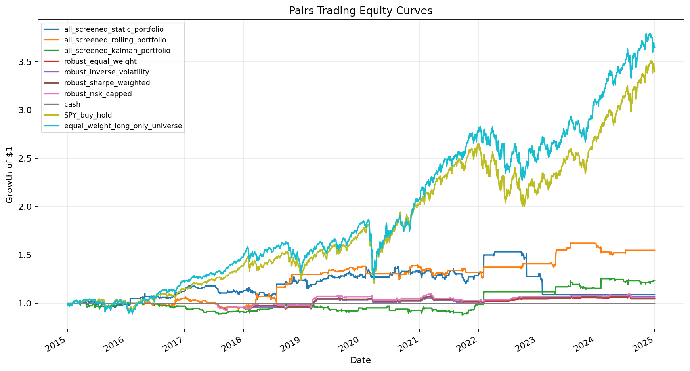
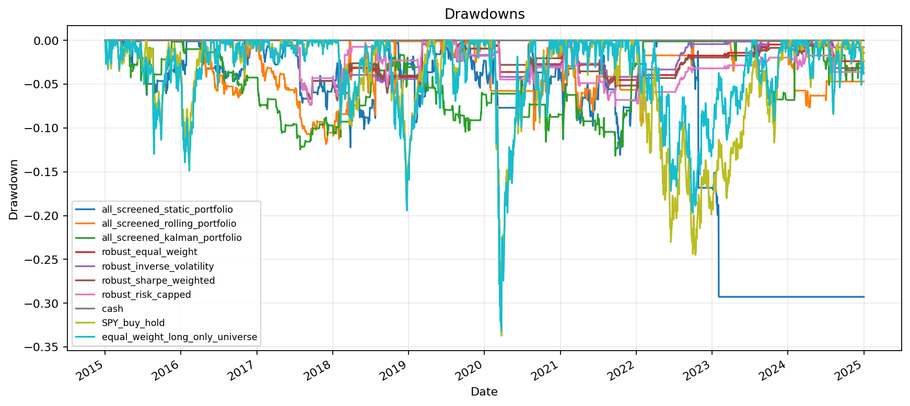
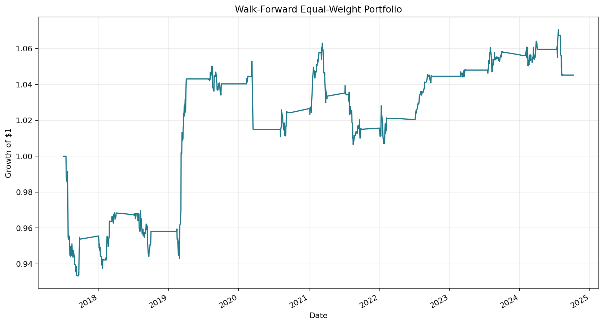
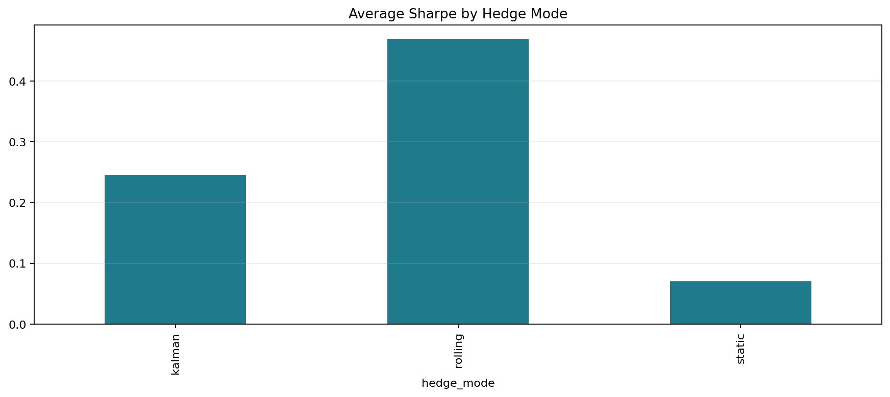
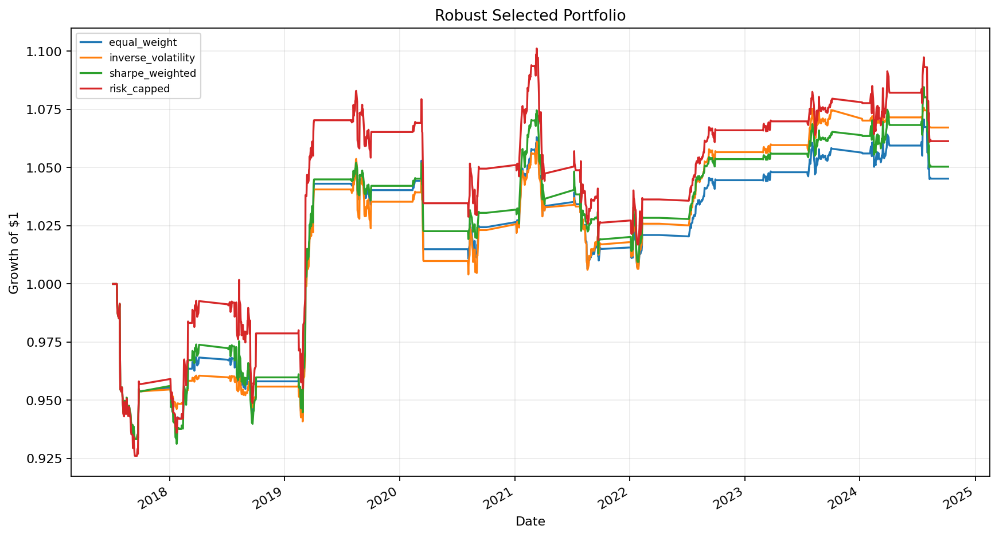
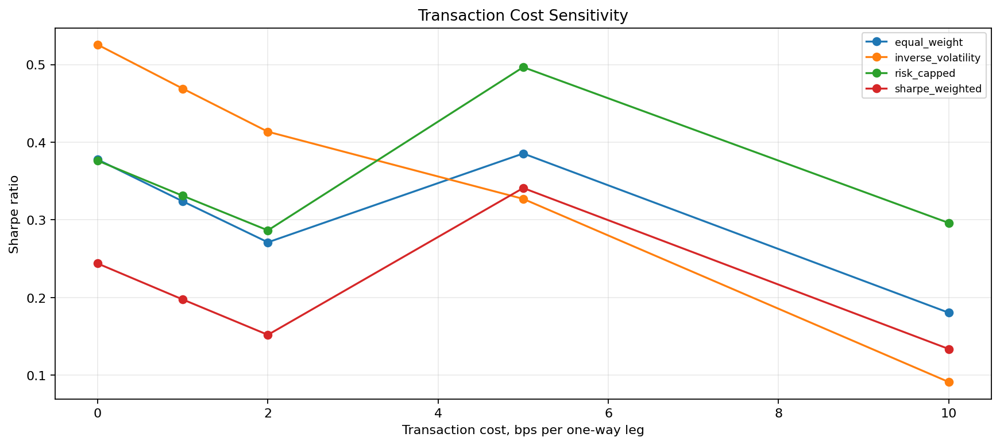
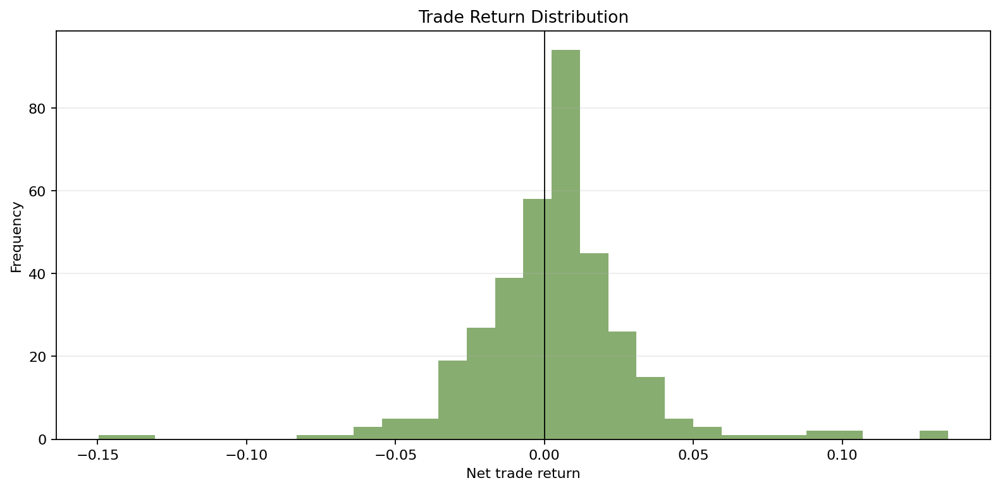
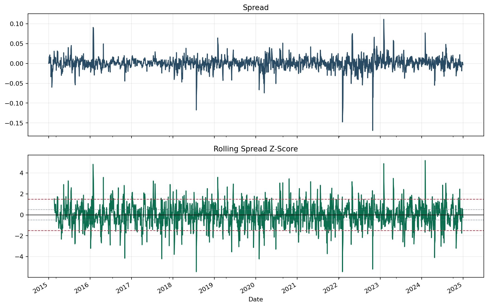
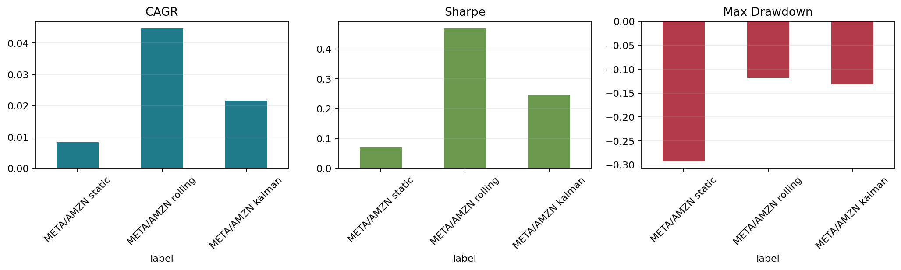

# Trading Research Dashboard: Pairs Trading & Walk-Forward Backtesting

An interactive quant research dashboard for statistical arbitrage research. The project tests stock peer-group pairs and economically related ETF pairs with cointegration diagnostics, OU-style spread statistics, static/rolling/Kalman hedge ratios, trade-level analytics, nested walk-forward pair selection, portfolio weighting, transaction-cost sensitivity, and benchmark-relative metrics.

The project remains a research validation dashboard, not a claim of a production trading strategy. Results below are generated by `python main.py`.

## Key Results

- Previous stock-only nested walk-forward portfolio was about `-0.47%` total return with `-0.10` Sharpe. The new robust selected portfolio improved to positive returns after 5 bps costs.
- Best robust selected portfolio: `inverse_volatility`, with `6.72%` total return, `0.65%` CAGR, `0.38` Sharpe, and `-6.67%` max drawdown.
- Best all-screened hedge mode: `rolling`, averaging `54.73%` total return and `0.47` Sharpe across the stable screened pool.
- Kalman hedge ratios improved over static OLS on the all-screened comparison, but did not beat rolling OLS in this run.
- Strict stock filters found one stable candidate: `META/AMZN`.
- Strict ETF filters found no stable candidates under the full training Sharpe/drawdown requirements. ETF pairs still appear in robust validation through diagnostic fallback candidates, most notably `VEA/EEM`.
- Results remain modest versus long-only equity benchmarks. SPY returned `239.57%` over the same sample, but it has directional market exposure and is not a market-neutral comparison.

## Methodology

The batch workflow runs both `stock_peer_groups` and `etf_peer_groups`.

Strict pair diagnostics require:

- training correlation >= `0.85`
- Engle-Granger p-value <= `0.05`
- residual ADF p-value <= `0.05`
- spread half-life between `3` and `45` trading days
- at least `8` z-score threshold crossings
- at least `5` completed training trades
- training Sharpe > `0.25`
- training max drawdown better than `-20%`

OU diagnostics estimate AR(1) coefficient, mean-reversion speed, half-life, equilibrium mean, and residual volatility. The default z-score window is `round(2 * half_life)`, bounded between 20 and 90 trading days.

The robust selected portfolio uses nested train/validation/test windows:

- training window: `504` trading days
- validation window: `126` trading days
- test window: `63` trading days

Within each segment, candidate pair diagnostics use training data only. Hedge mode and risk parameters are selected on validation data only. Final performance is measured on the following test window only.

## Universes

Stock peer groups:

- `mega_cap_tech`: AAPL, MSFT, GOOGL, META, AMZN
- `semiconductors`: NVDA, AMD, INTC, QCOM, AVGO, MU
- `banks`: JPM, BAC, C, GS, MS, WFC
- `energy`: XOM, CVX, COP, EOG, SLB
- `retail_consumer`: COST, WMT, HD, LOW, TGT
- `healthcare`: UNH, MRK, PFE, ABBV, JNJ

ETF peer groups:

- `broad_equity`: SPY, IVV, VOO, VTI, SCHB
- `nasdaq_growth`: QQQ, XLK, VGT, IYW
- `international_equity`: EFA, VEA, IEFA, EEM, VWO
- `treasuries`: SHY, IEI, IEF, TLH, TLT, GOVT
- `gold`: GLD, IAU, SGOL
- `real_estate`: VNQ, SCHH, IYR
- `energy`: XLE, VDE, XOP, OIH
- `financials`: XLF, VFH, KBE, KRE

Default period: `2015-01-01` to `2024-12-31`.

## Generated Tables

### Stable Candidate Summary

| Universe mode | Pairs screened | Stable candidates | Avg training Sharpe |
| --- | ---: | ---: | ---: |
| etf_peer_groups | 59 | 0 | -1.96 |
| stock_peer_groups | 70 | 1 | 0.06 |

### Strict Stable Candidate

| Universe | Peer group | Pair | Corr | Coint p | ADF p | Half-life | Train Sharpe | Profit factor |
| --- | --- | --- | ---: | ---: | ---: | ---: | ---: | ---: |
| stock_peer_groups | mega_cap_tech | META/AMZN | 0.95 | 0.0374 | 0.0093 | 16.8 | 0.64 | 2.56 |

### Hedge Mode Comparison

| Hedge mode | Avg total return | Avg Sharpe | Avg max drawdown |
| --- | ---: | ---: | ---: |
| kalman | 23.75% | 0.25 | -13.18% |
| rolling | 54.73% | 0.47 | -11.85% |
| static | 8.70% | 0.07 | -29.27% |

### Robust Selected Portfolio

| Strategy | Total return | CAGR | Sharpe | Max drawdown |
| --- | ---: | ---: | ---: | ---: |
| equal_weight | 4.53% | 1.19% | 0.26 | -6.67% |
| inverse_volatility | 6.72% | 1.75% | 0.38 | -6.67% |
| sharpe_weighted | 5.04% | 1.32% | 0.26 | -6.87% |
| risk_capped | 6.14% | 1.60% | 0.25 | -7.65% |

### Cost Sensitivity

| Cost bps | Strategy | Total return | Sharpe |
| ---: | --- | ---: | ---: |
| 0 | inverse_volatility | 8.05% | 0.53 |
| 1 | inverse_volatility | 7.16% | 0.47 |
| 2 | inverse_volatility | 6.29% | 0.41 |
| 5 | inverse_volatility | 4.78% | 0.33 |
| 10 | inverse_volatility | 1.31% | 0.09 |
| 10 | risk_capped | 5.99% | 0.30 |

Cost sensitivity is not perfectly monotonic for all methods because pair-level drawdown stops can change realised exposure when costs change.

### Benchmark Context

| Strategy | Total return | CAGR | Sharpe | Beta to SPY | Corr to SPY | Alpha vs SPY | Max DD | Monthly win |
| --- | ---: | ---: | ---: | ---: | ---: | ---: | ---: | ---: |
| robust_inverse_volatility | 6.72% | 0.65% | 0.23 | 0.01 | 0.07 | 0.51% | -6.67% | 21.67% |
| robust_risk_capped | 6.14% | 0.60% | 0.15 | 0.01 | 0.05 | 0.45% | -7.65% | 20.83% |
| all_screened_rolling_portfolio | 54.73% | 4.47% | 0.47 | -0.01 | -0.01 | 4.54% | -11.85% | 31.67% |
| cash | 0.00% | 0.00% | 0.00 | 0.00 | n/a | 0.00% | 0.00% | 0.00% |
| SPY_buy_hold | 239.57% | 13.03% | 0.74 | 1.00 | 1.00 | -0.01% | -33.72% | 69.17% |
| equal_weight_long_only_universe | 264.93% | 13.84% | 0.82 | 0.92 | 0.96 | 1.86% | -33.16% | 67.50% |

## Charts



















## Run

Install dependencies:

```bash
pip install -r requirements.txt
```

Run batch analysis:

```bash
python main.py
```

Run the dashboard:

```bash
streamlit run app.py
```

## Outputs

Generated CSV outputs:

- `outputs/pair_screening_results.csv`
- `outputs/pair_stability_diagnostics.csv`
- `outputs/hedge_mode_comparison.csv`
- `outputs/nested_pair_selection.csv`
- `outputs/nested_walk_forward_results.csv`
- `outputs/nested_walk_forward_daily_returns.csv`
- `outputs/pair_portfolio_comparison.csv`
- `outputs/cost_sensitivity.csv`
- `outputs/benchmark_relative_metrics.csv`
- `outputs/trade_log.csv`
- `outputs/trade_analytics.csv`
- `outputs/daily_returns.csv`

Generated PNG outputs are committed so charts render in the README. CSV files are ignored because they are reproducible generated artifacts.

## Limitations

- yfinance data quality can vary and may include missing values, revisions, and vendor-specific adjustments.
- The stock and ETF universes are static and can contain survivorship bias.
- Borrow fees, short availability, taxes, financing costs, and intraday execution are not modelled.
- Transaction costs are simplified as fixed bps per one-way leg.
- Rolling and Kalman hedge ratios do not include explicit hedge-rebalancing transaction costs.
- The robust selected portfolio uses a staged threshold search for runtime practicality, not a full exhaustive grid.
- ETF strict filters were very demanding in this run and produced no strict stable ETF candidate.
- Positive results are modest and should be treated as research leads, not proof of a deployable strategy.
