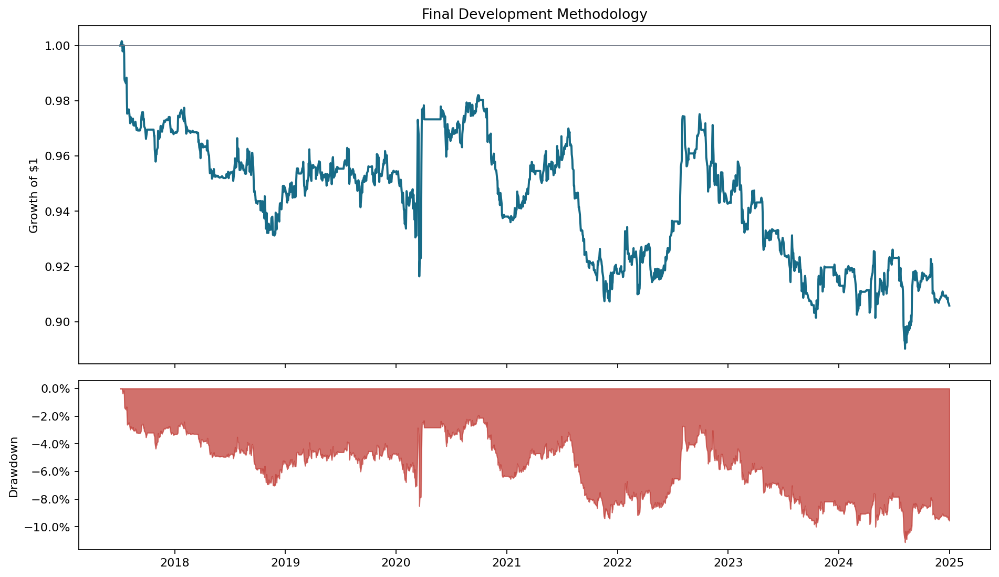
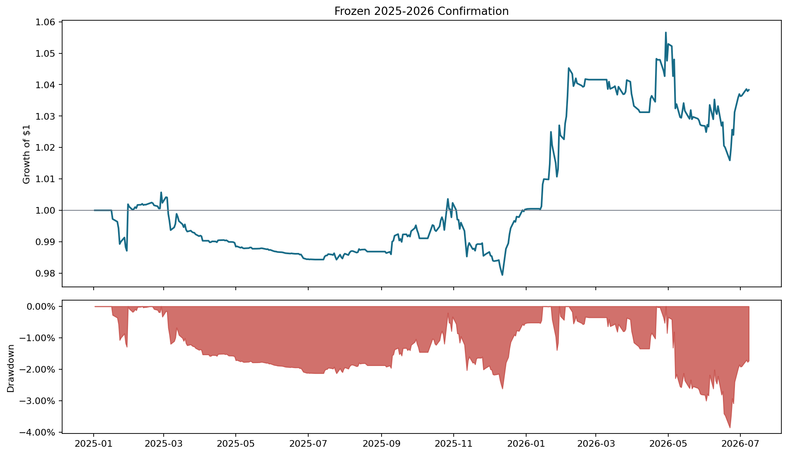
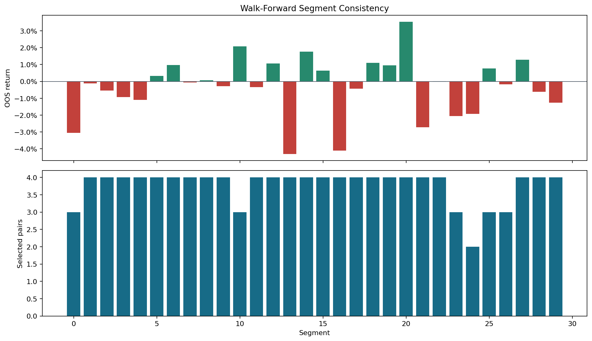
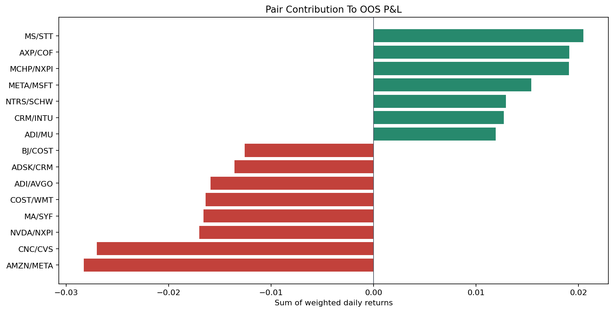
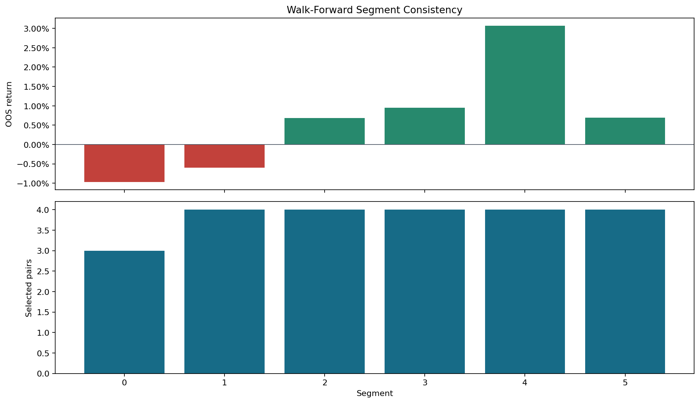
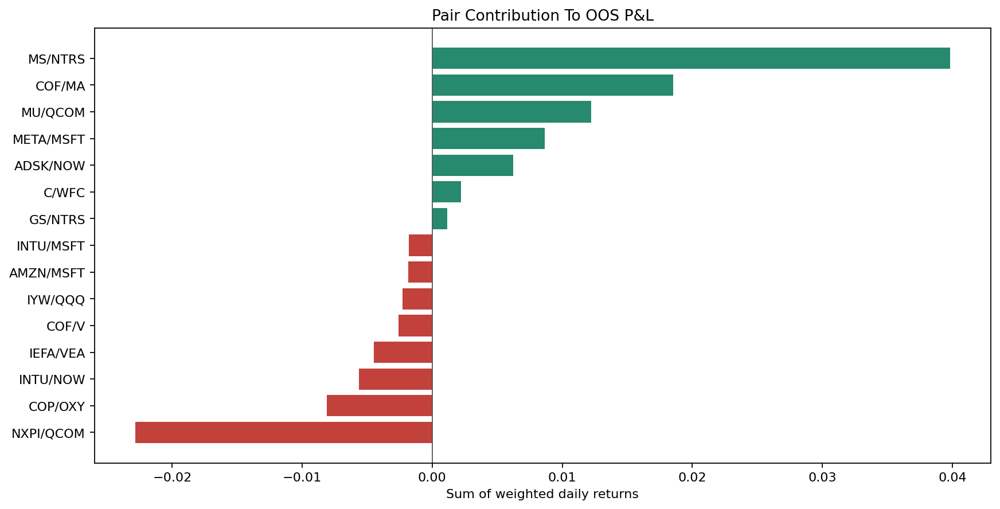
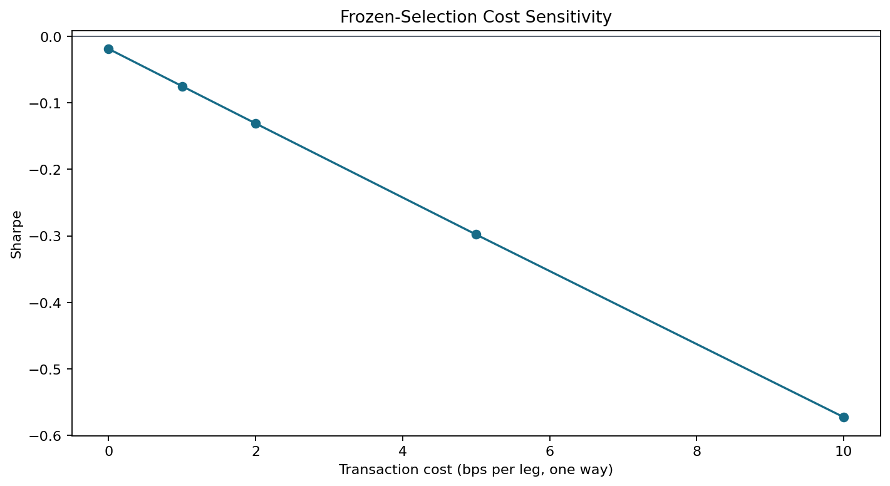
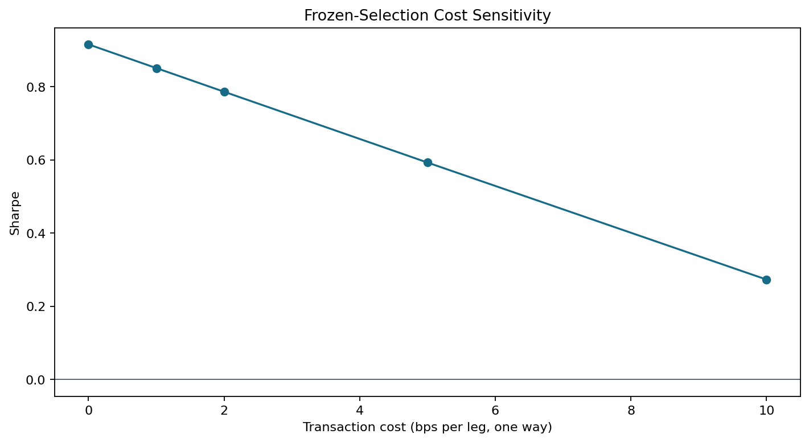

# Trading Research Dashboard: Pairs Trading & Walk-Forward Backtesting

A reproducible statistical-arbitrage research framework for asking a harder question than "did this backtest make money?": does a pair-selection process remain credible after clean timing controls, realistic costs, broader participation, concentration limits, and a fresh confirmation period?

The answer is mixed. The redesigned method is broader and methodologically stronger, but negative over the 2015-2024 development experiment. A frozen 2025-2026 confirmation is positive, though still too small and uncertain to establish a deployable edge.

## Key Results

| Evidence set | Total return | Sharpe | Max DD | OOS trades | Unique pairs | Peer groups |
| --- | ---: | ---: | ---: | ---: | ---: | ---: |
| Archived baseline headline | 20.72% | 0.68 | -9.06% | 29 | 5 | 3 |
| Final 2015-2024 development method | -9.41% | -0.30 | -11.12% | 199 | 62 | 17 |
| Frozen 2025-2026 confirmation | 3.83% | 0.59 | -3.85% | 43 | 19 | 12 |

The baseline is preserved, not erased. Its stronger headline comes with one selected pair per segment, alternating-quarter test coverage, a candidate pool frozen from the first training window, and a test-boundary state issue. The final method sacrifices that headline for contiguous coverage, flat test starts, rolling discovery, much broader evidence, and low pair-level P&L concentration.

The confirmation result is encouraging, not conclusive. It contains six segments and 43 trades; its bootstrap Sharpe interval is `[-0.88, 2.00]`, and one pair contributes 28.34% of absolute confirmation P&L.





## Why Naive Pairs Backtests Mislead

Pairs research can look compelling when pair identities, hedge ratios, thresholds, dates, filters, or portfolio weights are chosen with knowledge of later performance. Cointegration can also break, validation samples can contain only a few trades, and trading costs can consume a small gross edge.

This repository therefore treats the workflow itself as the research object:

1. Economic peer groups constrain the search space.
2. Each segment discovers pairs from its own training window only.
3. Validation and test states start flat.
4. Signals and hedge ratios are applied to returns with a one-day lag.
5. Portfolio weights are computed from pre-test information.
6. Test windows are contiguous and non-overlapping.
7. Development evidence is separated from a frozen 2025+ confirmation.
8. Failed experiments remain documented.

## Final Frozen Methodology

The versioned configuration is [config/final_methodology_v1.json](config/final_methodology_v1.json), with SHA-256:

`06a2b8567e4247684fe07a8ca37cbdf7887ed8a709cf177fcaef8caacc44fd1f`

### Windows

- Training: 504 trading days
- Validation: 126 trading days
- Test: 63 trading days
- Step: 63 trading days
- Development: 2015-01-01 through 2024-12-31
- Confirmation: 2025-01-01 through 2026-07-31

### Pair Discovery

- Configurable stock-industry and economically related ETF peer groups
- At least 95% pair data coverage
- Correlation pre-screen before expensive stationarity tests
- Engle-Granger and residual ADF diagnostics
- OU/AR(1) half-life and half-life-informed z-score window
- Three 252-day training subwindows for correlation, stationarity, half-life, hedge-ratio, and spread-volatility stability
- Internally forward training-viability check after assumed costs
- Pair identities rediscovered inside every training window

The equity universe is intentionally broader than the baseline but remains economically grouped. It is a present-day universe, so survivorship bias is disclosed rather than treated as solved.

### Signal And Portfolio

- Recursive Kalman intercept and hedge ratio
- Entry at `|z| >= 2.0`
- Exit at zero crossing
- Stop at `|z| >= 3.5`
- Maximum hold: 20 trading days
- Maximum four pairs per segment
- Maximum one simultaneous pair per ticker
- Maximum two pairs per peer group
- Pair-return correlation limit: 0.80
- Constrained inverse-volatility weights
- Maximum pair weight: 35% when feasible
- No portfolio volatility target

The final strategy is deliberately simpler than the staged pair-specific optimiser. In development, selected validation Sharpe had approximately zero relationship with the next test return, so per-pair threshold and hedge-mode optimisation was rejected.

## Timing And Leakage Controls

- Rolling OLS estimates at date `t` use observations strictly before `t`.
- Kalman state updates are causal; hedge exposure is shifted before return attribution.
- Z-scores use current and past spread data, but target positions are shifted one day before realised returns.
- Validation and test begin with no inherited position.
- Training dates precede validation dates; validation dates precede test dates.
- Candidate diagnostics store each segment's explicit training boundary.
- Test observations never enter candidate, parameter, or weighting decisions for that segment.
- Volatility scaling utilities are lagged, although the frozen final portfolio does not use volatility targeting.

These properties are covered by automated tests.

## Development Experiments

| Experiment | Return | Sharpe | Max DD | Trades | Pairs | Groups | Decision |
| --- | ---: | ---: | ---: | ---: | ---: | ---: | --- |
| Rolling discovery, original universes | -32.49% | -0.85 | -35.25% | 217 | 50 | 10 | Rejected |
| Expanded discovery, staged optimiser | -35.58% | -0.83 | -38.18% | 337 | 58 | 13 | Rejected |
| Fixed Kalman, validation-ranked pairs | -16.89% | -0.43 | -20.95% | 146 | 46 | 15 | Rejected |
| Fixed Kalman, training-ranked equal weight | -11.52% | -0.33 | -13.07% | 199 | 62 | 17 | Core retained |
| Final constrained inverse volatility | -9.41% | -0.30 | -11.12% | 199 | 62 | 17 | Frozen |

The final development result did not beat the archived `0.68` Sharpe. It is retained because it is cleaner, broader, less concentrated, and simpler. See [reports/experiment_log.md](reports/experiment_log.md) for the complete decision record.





## Fresh Confirmation

The final configuration and evaluation gates were written and hashed before any 2025+ prices were requested. The confirmation pipeline then ran once.

- Total return: 3.83%
- Sharpe: 0.59
- Maximum drawdown: -3.85%
- Trades: 43
- Positive segments: 4 of 6
- Beta to SPY: -0.010
- Newey-West mean-return p-value: 0.421

This positive period does not retroactively justify changing the development methodology. No model, universe, threshold, weighting rule, or period was altered after observation.





## Costs And Borrow

The transaction-cost parameter is **basis points per leg per one-way position change**. A simple two-leg pair entry therefore incurs approximately twice the configured rate, with another charge on exit.

| Cost per leg | Development return | Development Sharpe | Confirmation return | Confirmation Sharpe |
| ---: | ---: | ---: | ---: | ---: |
| 0 bps | -0.61% | -0.02 | 5.95% | 0.92 |
| 1 bp | -2.44% | -0.07 | 5.52% | 0.85 |
| 2 bps | -4.23% | -0.13 | 5.10% | 0.79 |
| 5 bps | -9.41% | -0.30 | 3.83% | 0.59 |
| 10 bps | -17.44% | -0.57 | 1.76% | 0.27 |

Borrow sensitivity is illustrative because no historical borrow series is available. Assuming 50% short gross exposure, a 3% annual borrow rate reduces development return to `-14.19%` and confirmation return to `2.79%`.





## Dashboard

Run:

```bash
streamlit run app.py
```

The dashboard contains separate views for:

- baseline, development, and confirmation evidence;
- segment-specific pair discovery diagnostics;
- explicit train/validation/test boundaries;
- selected pairs, weights, ticker exposure, peer-group exposure, and P&L contribution;
- cost, borrow, weighting, volatility-target, bootstrap, and benchmark diagnostics;
- frozen 2025-2026 confirmation;
- an exploratory live pair lab kept separate from frozen evidence.

## Reproduce The Research

Install dependencies:

```bash
pip install -r requirements.txt
```

Run the frozen final development pipeline:

```bash
python main.py
```

Rebuild reports from committed deterministic tables without rerunning research:

```bash
python main.py --phase development --experiment final --resume
```

Run every recorded development experiment from scratch:

```bash
python main.py --phase development --experiment all
```

This is intentionally slower because each segment performs fresh training-only discovery.

The committed confirmation is protected against accidental reruns. An explicit reproduction requires:

```bash
python main.py --phase confirmation --confirmation-end 2026-07-31 --allow-confirmation-rerun
```

That command reproduces evidence; it must not be used to retune the frozen configuration.

## Tests

```bash
python -m compileall main.py app.py src tests
pytest -q
```

The suite covers data validity, synthetic cointegration, hedge-ratio scale, deterministic signals, next-day execution, transaction-cost reconciliation, clean test starts, causal rolling hedges, chronological walk-forward boundaries, lagged volatility scaling, portfolio caps, ticker concentration, and deterministic statistics.

GitHub Actions runs compilation and tests on pushes and pull requests.

## Project Structure

```text
.
|-- app.py
|-- main.py
|-- config/
|   `-- final_methodology_v1.json
|-- src/
|   |-- backtest.py
|   |-- config.py
|   |-- data.py
|   |-- discovery.py
|   |-- experiment.py
|   |-- metrics.py
|   |-- pairs.py
|   |-- plots.py
|   |-- portfolio.py
|   |-- reporting.py
|   |-- signals.py
|   |-- statistics.py
|   |-- universes.py
|   `-- walk_forward.py
|-- tests/
|-- reports/
|   |-- baseline/
|   |-- development/
|   `-- confirmation/
`-- outputs/
```

## Reports

- [Baseline report](reports/baseline_report.md)
- [Research design and audit](reports/research_design.md)
- [Final methodology](reports/final_methodology.md)
- [Development results](reports/development_results.md)
- [Confirmation results](reports/confirmation_results.md)
- [Experiment log](reports/experiment_log.md)
- [Limitations](reports/limitations.md)

## Limitations

- Yahoo Finance data can be revised and is not executable quote data.
- The static present-day universe creates survivorship bias.
- Historical liquidity, short availability, and borrow rates are unavailable.
- Fixed transaction costs simplify spreads and market impact.
- Cointegration tests are sample-sensitive; relationships can break abruptly.
- Development involved multiple research experiments and is not a pristine holdout.
- Confirmation has only 378 observations, 43 trades, and six segments.
- Taxes, financing, margin rules, intraday paths, and live execution are absent.

This is a research-validation dashboard and engineering portfolio project. It should not be interpreted as investment advice or a production trading system.
